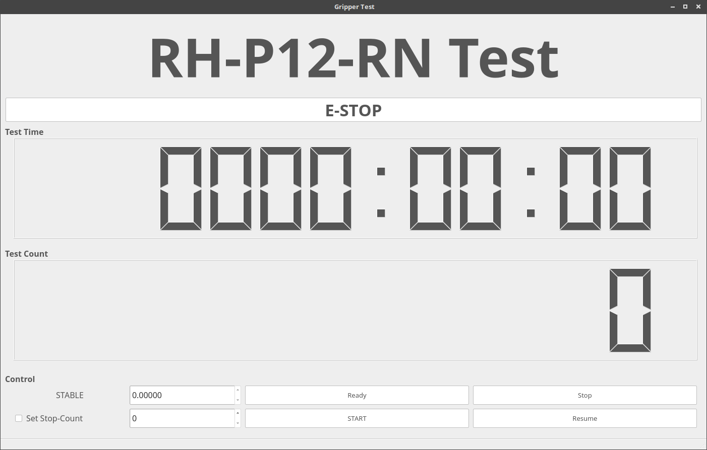

# Gripper-TEST

## Structure
- test_gripper_manager
  - control test manager
  - save & load the prev test information : data file path, test count, test time
  - test tasks : grasp_on, move_up, wait 3 sec, move_down, grasp_off

- test_gripper_module
  - control gripper and joint_1,2
  - play sub_task : move_up, move_down, grasp_on, grasp_off
  - save the number of test and the task
  - save the data of joints : hw error, goal_position, present_position, present_current, present_temperature

- test_gripper_gui  


## Data files
- monitoring data : test_gripper_module/data/DATE.csv
- test data : test_gripper_module/data/prev_test.yaml

## How to run the program
- turn on the power supply
- open the terminal
- type like the below
```
$ roslaunch test_gripper_manager test_gripper_manager.launch
```

## How to start the test
- Go ready : click `ready` button
- Go start
  - If you want to continue the test, click `start_continue`.
  - If not(first time), click `start`.
- Stop(Pause)
  - If you click `stop` button, it stops after playing the last task(grasp_off).
- Resume
  - If you click `resume` button, test starts again.
- E-Stop
  - If you click `E-Stop` in the upper side, test stops after the current task is finished.
- **RH-P12-RN Test (Hidden button)**
  - If you click this hidden button, all control buttons are changed between enable mode and disable mode.

## How to terminate
- Click `stop` button and wait for the test set to stop.  
- Switch an window to the terminal that launched the test package.
- `Ctrl + C`
- turn off the power supply
- turn off the test PC
